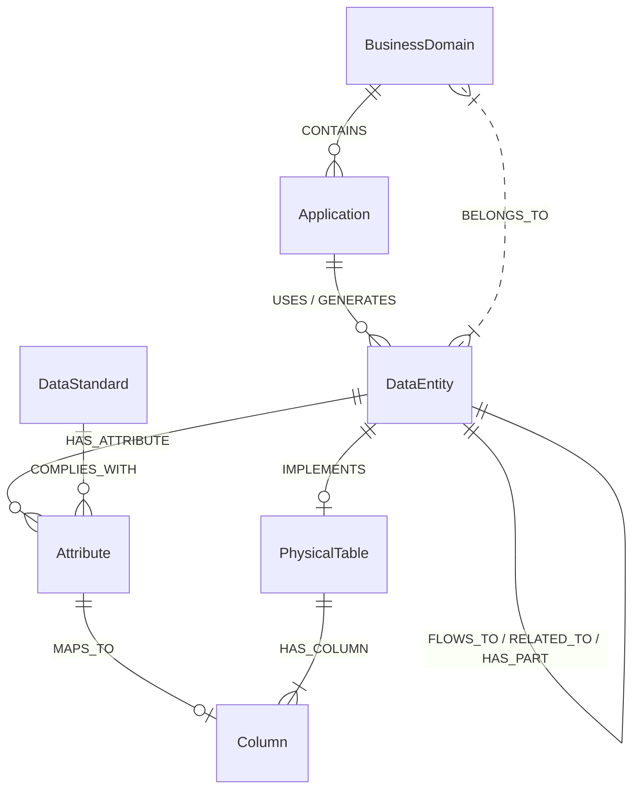
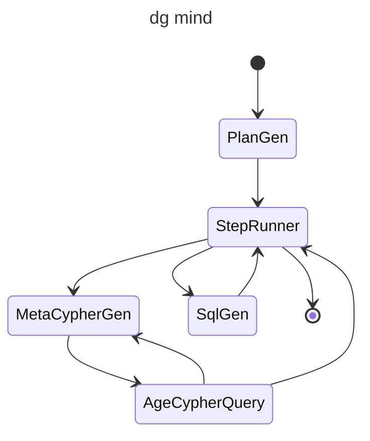

# dg_agent

## 概述
dg_agent 是一个Python数据治理工具，提供数据治理相关的自动化功能。

### 主要特性
1. **数据模型架构查询**
   -  通过问答接口查询业务域、应用、数据实体的内容和关系
   -  支持自然语言查询和结构化查询
2. **数据治理自动化**
   -  自动生成数据治理报告
   -  数据质量监控
3. **多模型支持**
   -  支持不同AI模型的接入
   -  提供统一接口调用不同模型

笔记：https://www.wolai.com/kJ5LuHxJhnio3wvHDnmSFe

## 元模型结构


### 模块功能

## 配置
配置文件使用YAML格式，默认路径为`settings.yaml`，示例如下：

```yaml
agents:
  plan_agent:
    model_name: bailian:qwen-max
    api_key: sk-xxxxx
  ner_agent:
    model_name: bailian:qwen-max
    api_key: sk-xxxxx
# 选择 apache age 作为图数据库
age:
  graph: <graph name>
  dsn: "host=<ip> port=<port> dbname=<db> user=<username> password=<password>"
# 或 选择 kuzu 作为图数据库
kuzu:
  database: "<present database path>"
current_graph: "age" # 选择 age 或 kuzu
chromadb: # 向量数据库  
  persist_directory: "<path>"
  cypher_collection: "cypher_hint" # 参考 cypher
  names_collection : "name_hint" # 参考标准名称
  embedding_model : "nlp_gte_sentence-embedding_chinese-base"
```


**bot/agent**
- **dg_support.py**: 数据治理的支持agent，提供业务域、应用、数据实体的相关信息

### 变更
#### 2025-03-29
取出了之前依赖小模型（4B-7B）的dg_mind实现方式，保留了一个单独Agent支持图数据库查询、SQL生成等综合性工作。
此前在 https://www.wolai.com/tA2YoReUTkBMBThZj3kpNK 中记录了之前的实现方式。
考虑在本地使用更低的成本实现运行，不过这种DAG工作流的实现用户体验上并不好，各个步骤上耗时相对比较长。
同时，在本地运行时比较明显的会出现token过长的问题，导致模型推理失败。
个人观点，小模型集体运行的形式还是为了在有限条件下保证信息封闭的权宜之计。
目前体验最好的还是Qwen-max的百炼接口，运行稳定且成本也不高，还可以支持比较复杂的问询，例如比较出不同业务域里金额相关数据列的数据定义差异。

另外，图数据库的后端也暂时从Apache AGE （PG）改成了Kuzu。Apache AGE的驱动还是太小众了，而且kuzu的本地文件版本构建也更方便。
后续看情况是否回复对Apache AGE的支持，毕竟PG数据库的生产环境的使用还是更多一些。




## 项目结构

```
dg_agent/
├── src/                     # 源代码目录
│   ├── bot/                 # 核心业务模块
│   │   ├── agent/          # 代理实现
│   │   │   ├── __init__.py
│   │   │   └── dg_support.py
│   │   ├── graph/          # 图数据库实现
│   │   │   ├── __init__.py
│   │   │   ├── age_graph.py
│   │   │   ├── base_graph.py
│   │   │   ├── kuzu_graph.py
│   │   │   └── ontology/   # 本体定义
│   │   │       └── kuzu/
│   │   ├── models/         # 模型实现
│   │   │   ├── __init__.py
│   │   │   └── siliconflow.py
│   │   ├── provider/       # 模型提供方
│   │   │   ├── bailian.py
│   │   │   ├── ollama.py
│   │   │   ├── siliconflow.py
│   │   │   └── vllm.py
│   │   ├── chat_app.py     # 主程序入口
│   │   ├── console.py     # 控制台接口
│   │   ├── mcp_cypher_server.py # Cypher服务
│   │   ├── settings.py    # 配置管理
│   │   └── web/           # Web界面
│   │       ├── chat_app.html
│   │       ├── chat_app.ts
│   │       └── marked.d.ts
│   └── make_graph/        # 图数据处理模块
│       ├── application.py # 应用层实现
│       ├── csv2age.py     # AGE导入
│       ├── csv2kuzu.py    # Kuzu导入
│       ├── dataentity.py  # 数据实体
│       ├── domain.py      # 领域模型
│       ├── fetch_metadata.py # 元数据获取
│       ├── reload_graph.py # 图数据加载 从一个drawio的数据架构设计将 业务域、应用、数据实体导出成csv
│       ├── reload_relate.py # 关系加载 TODO: 关系加载，目前是手动编写Excel的，还没想好管理方式
│       ├── reload_table.py # 表数据加载 从excel（包含数据库 表定义、列定义、物理表和数据实体关联）穿换成csv，
│       │                     这份前置的excel是半人工的加工过程，从数据库导出元数据，利用机器学习做了数据实体和物理表的相似性比较，人工确认后生成excel。
│       └── reload_term.py # 术语加载，也是一份人工维护的excel
├── tests/                  # 测试模块
│   ├── test_age_graph.py
│   ├── test_dg_support_agent.py
│   ├── test_kuzu_graph.py
│   ├── test_mcp_server.py
│   ├── test_settings.py
│   └── test_vertex.py
├── pyproject.toml          # 构建配置
├── run.bat                 # Windows启动脚本
└── requirements.txt        # 依赖配置
```

## 开发
用了uv作为开发工具，网络好的话还是比较方便的。
### 运行测试
```bash
uv -m pytest
```

### 打包
```bash
uv build
```


## 许可证
本项目采用 [MIT 许可证](LICENSE)
