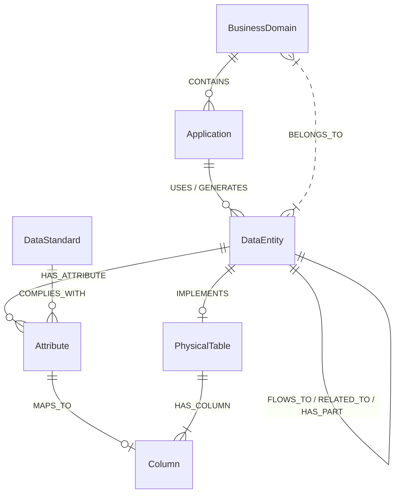
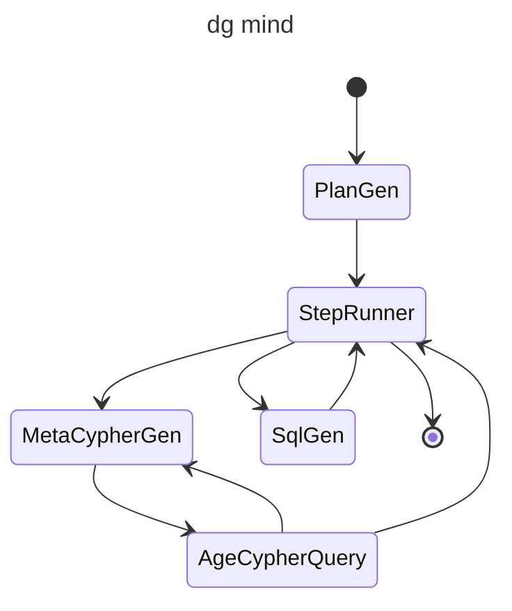

# dg_agent

## 概述
dg_agent 是一个Python数据治理工具，提供数据治理相关的自动化功能。

### 主要特性
1. **数据模型架构查询**
   -  通过问答接口查询业务域、应用、数据实体的内容和关系
   -  支持自然语言查询和结构化查询
2. **数据治理自动化**
   -  自动生成数据治理报告
   -  数据质量监控
3. **多模型支持**
   -  支持不同AI模型的接入
   -  提供统一接口调用不同模型

笔记：https://www.wolai.com/kJ5LuHxJhnio3wvHDnmSFe

## 元模型结构


## 安装

### 通过pip安装
```bash
pip install .
```

### 开发模式安装
```bash
pip install -e .
```

## 使用

### 命令行使用
安装后可以通过以下命令运行：
```bash
dg-agent
```

### 模块功能

## 配置
配置文件使用YAML格式，默认路径为`settings.yaml`，示例如下：

```yaml
agents:
  chat_agent:
    model_name: ollama:deepseek-r1:8b
    api_key: ANY
  age_agent:
    model_name: bailian:qwen-max
    api_key: sk-xxxxx
  plan_agent:
    model_name: bailian:qwen-max
    api_key: sk-xxxxx
  sql_agent:
    model_name: bailian:qwen-max
    api_key: sk-xxxxx
age:
  graph: fsg_model
  dsn: "host={IP} port={PORT} dbname={DBNAME} user={USER} password={PASSWORD}"
```


**bot/agent**
- **age_cypher_agent.py**: 处理与年龄加密相关的数据治理任务
  - 生成年龄加密报告
  - 验证加密数据的完整性
- **plan_agent.py**: 执行计划agent，跟进用户问题意图规划执行计划
- **sql_agent.py**: 依据元模型获得的物理表的信息生成SQL
- **dg_mind.py**: 数据治理问答执行
  - 回答业务域、应用、数据实体的相关的问题
  - 帮助生产数据数据查询SQL


**bot/models**
- **siliconflow.py**: SiliconFlow模型实现
  - 提供模型推理接口
  - 支持模型性能评估

**graph**
- **application.py**: 应用元模型
- **domain.py**: 业务域元模型
- **entity.py**: 数据实体元模型
- **reload_graph.py**: 元模型数据加载
- **reload_table.py**: 数据库物理表数据加载

**tests**
- 单元测试模块，覆盖核心功能测试

## 项目结构

```
dg_agent/
├── bot/                     # 核心业务模块
│   ├── agent/               # 代理实现
│   │   ├── __init__.py
│   │   ├── age_cypher_agent.py
│   │   ├── data_gov_agent.py
│   │   └── gen_agent.py
│   ├── models/              # 模型实现
│   │   ├── __init__.py
│   │   └── siliconflow.py
│   ├── chat_app.py          # 主程序入口
│   └── settings.py          # 配置管理
├── graph/                   # 图数据处理模块
│   ├── application.py       # 应用层实现
│   ├── domain.py            # 领域模型
│   ├── entity.py            # 实体定义
│   ├── reload_graph.py      # 图数据加载
│   ├── reload_table.py      # 表数据加载
│   └── files/               # 数据文件
├── tests/                   # 测试模块
│   ├── __init__.py
│   ├── test_age_cypher_agent.py
│   ├── test_data_gov_agent.py
│   ├── test_gen_agent.py
│   ├── test_other.py
│   ├── test_settings.py
│   └── test_vertex.py
├── setup.py                 # 项目配置
├── pyproject.toml           # 构建配置
└── run.bat                  # Windows启动脚本
```

## 依赖

- Python >= 3.11
- pydantic-ai >= 0.0.24 
- logfire >= 3.5.3 
- age >= PG16-v1.5.0-rc0
- pytest >= 7.4.0
- lxml >= 5.3.1


## 开发

### 构建
```bash
python setup.py build
```

### 运行测试
```bash
python -m pytest
```

### 打包
```bash
python setup.py sdist bdist_wheel
```

## 贡献指南

1. Fork 项目仓库
2. 创建特性分支 (`git checkout -b feature/AmazingFeature`)
3. 提交更改 (`git commit -m 'Add some AmazingFeature'`)
4. 推送到分支 (`git push origin feature/AmazingFeature`)
5. 提交 Pull Request

## 许可证
本项目采用 [MIT 许可证](LICENSE)
